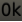
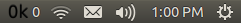
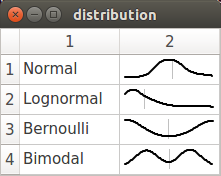
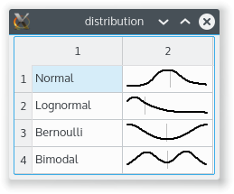

# dqtx 
A library of Qt extensions I have found useful

## Widgets
#### QSparkLineWidget 
QSparkLineWidget is a widget that draws a spark line (small graph) of a time series.  It is useful in QTableWidgets as an easy way of visualizing trends in data.

#### QSparkLineAndBarsWidget 
QSparkLineAndBarsWidget is a widget that displays a spark line on top and a bar chart on the bottom.  It tracks two coincident time series.  It makes the most sense when the line tracks a value over time and the bars track an event count of some sort over time (think price and volume for a stock).

#### QDensityWidget 
QDensityWidget is a widget that displays a density plot for a data set.  It is useful for easily visualizing a distribution.

## Other Useful Classes
#### QTextIconFactory 
QTextIconFactory has static functions for creating QIcons from arbitrary text.  It fits the text into the specified size and creates a QIcon.

#### QAppIndicator 
QAppIndicator is a wrapper for libappindicator that allows you to easily, and within Qt paradigms, create AppIndicators for Unity.

#### QIconTheme
QIconTheme creates a temporary icon theme with the icons and names that you give it.  These can then be accessed by classes that require icons from a theme (e.g. QAppIndicator).

## Examples
#### cpumonitor
cpumonitor is a small demo application that uses QSparklineWidget and QSparkLineAndBarsWidget to display CPU load on a system.  Each individual CPU is represented by a QSparkLineWidget.  The composite of all CPUs is represented by QSparkLineAndBarsWidget where the line represents the current CPU utilization and the bars represent currently running processes.

 

#### distribution
distribution is a small demo application that uses QDensityWidget and C++11 random number generators to display some density plots.

 

#### appindicator
appindicator is a small demo application that uses QAppIndicator, QIconTheme, and QTextIconFactory to display and hide a Unity AppIndicator.  The icon of the AppIndicator is generated by QTextIconFactory and is an ever increasing integer followed by the letter k.  It also has a label that is the same number as is displayed in the icon (this will only be visible in Unity).  The AppIndicator shows and hides itself every 5 seconds.  It has a menu with one item, Quit, that you can use to exit the example.

