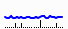
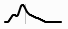
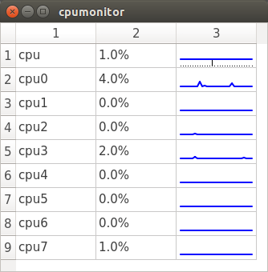
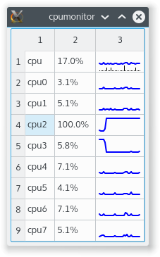

# dqtx 
A library of Qt extensions I have found useful

## Widgets
#### QSparkLineWidget 
QSparkLineWidget is a widget that draws a spark line (small graph) of a time series.  It is useful in QTableWidgets as an easy way of visualizing trends in data.

#### QSparkLineAndBarsWidget 
QSparkLineAndBarsWidget is a widget that displays a spark line on top and a bar chart on the bottom.  It tracks two coincident time series.  It makes the most sense when the line tracks a value over time and the bars track an event count of some sort over time (think price and volume for a stock).

#### QDensityWidget 
QDensityWidget is a widget that displays a density plot for a data set.  It is useful for easily visualizing a distribution.

## Examples
#### cpumonitor
cpumonitor is a small demo application that uses QSparklineWidget and QSparkLineAndBarsWidget to display CPU load on a system.  Each individual CPU is represented by a QSparkLineWidget.  The composite of all CPUs is represented by QSparkLineAndBarsWidget where the line represents the current CPU utilization and the bars represent currently running processes.

 
